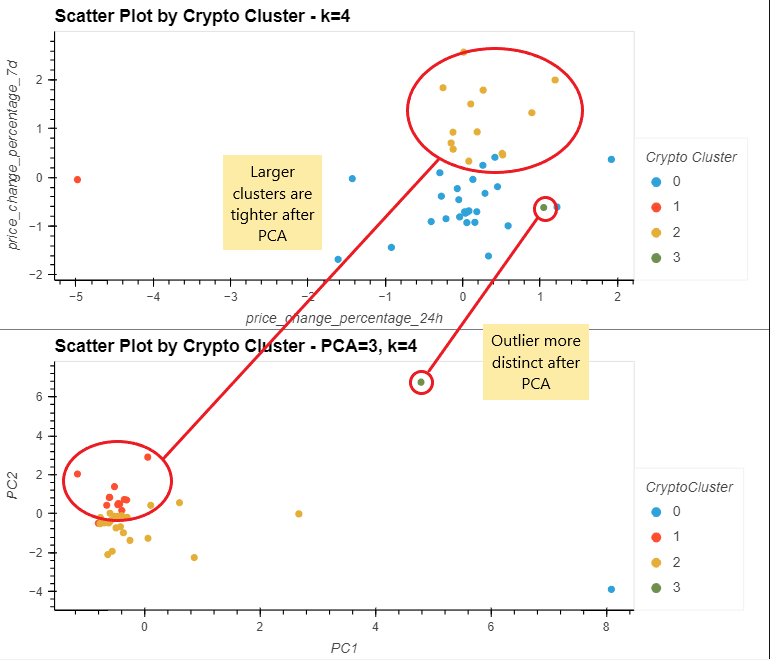
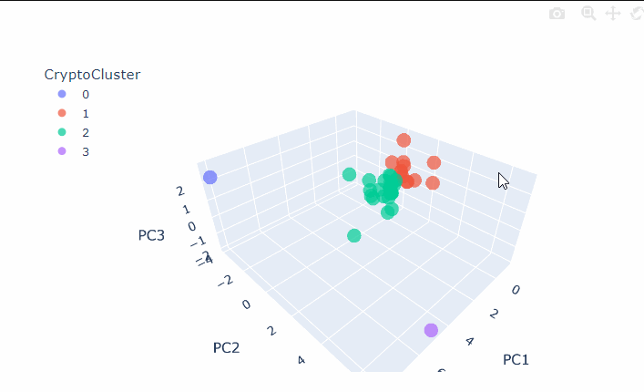

# Challenge 10: Unsupervised Machine Learning
UNCC Online FinTech Bootcamp Module 10 Challenge due by 11:59pm 2/13/2022

https://courses.bootcampspot.com/courses/980/files/1039581/download

---

## Background

In this Challenge, we’ll assume the role of an advisor in one of the top five financial advisory firms in the world. Competitors are fierce, so we want to propose a novel approach to assembling investment portfolios that are based on cryptocurrencies. Instead of basing our proposal on only returns and volatility, we will include other factors that might impact the crypto market — leading to better performance for your portfolio.

When we present the idea, our manager loves it! So, we’re asked to create a prototype for submitting our crypto portfolio proposal to the company board of directors.

---

## What's Being Created

In this Challenge, we’ll combine our financial Python programming skills with the new unsupervised learning skills that we acquired in this module.

We’ll create a Jupyter notebook that clusters cryptocurrencies by their performance in different time periods. We’ll then plot the results so that we can visually show the performance to the board.

The CSV file that’s provided for this Challenge contains the price change data of cryptocurrencies in different periods.

---

## Technologies

This application is written in Python 3.7 using JupyterLab version 3.0.14.

Python libraries used:

 - [Pandas](https://pandas.pydata.org/pandas-docs/stable/) - *an open source, BSD-licensed library providing high-performance, easy-to-use data structures and data analysis tools for the Python programming language.*
 - [Pathlib](https://docs.python.org/3.7/library/pathlib.html) - *a library that enables consistent input and output of files from the main app.*
 - [hvPlot](https://hvplot.holoviz.org/user_guide/Introduction.html) - *a high-level plotting API for the PyData ecosystem built on HoloViews.*
 - [scikit-learn](https://scikit-learn.org/stable/user_guide.html) - *an open source machine learning library that supports supervised and unsupervised learning.*
 - [plotly](https://plotly.com/python/) - *an interactive, open-source, and browser-based graphing library for Python.*
 - [seaborn](https://seaborn.pydata.org/installing.html) - *a visualization library based on matplotlib. It provides a high-level interface for drawing attractive and informative statistical graphics.*

### Installation Guide

prior to running these libraries, install them from the command line:
  - pandas: `conda install pandas` or `pip install pandas`  
  - pathlib: `pip install pathlib`
  - hvPlot: `conda install -c pyviz hvplot` or `pip install hvplot`
  - sklearn: `pip install-U scikit-learn` - included in conda
  - plotly: `pip install plotly==5.5.0`
  - seaborn: `pip install seaborn` or `conda install seaborn`
  
---

## Usage

After visually analyzing the cluster analysis results, what is the impact of using fewer features to cluster the data by using K-means?

By using PCA and using fewer features to cluster the data, it is easier to visualize the clusters (including the two that are single-member outliers). The members of each cluster don't appear to have changed, but they are more tigthly clustered. The outlier celsius-degree-token is visually easier to see as dissimilar using PCA; prior to PCA it was visually within the sphere of a different cluster, but not part of it.

We can also take a deeper dive into the PCA results by plotting all three PCA features using plotly express. This is a quick way to compare each of the 3 components against eachother by turning the plot around so that all combinations of the components can be viewed (i.e. PCA1 vs PCA2; PCA1 vs PCA3; and PCA2 vs PCA3).

Now that we have developed a way to group crypto assets, we can use that information to diversify our portfolios, by including investments from each of the main clusters.

---
 
### Contributors

Geoff Tarleton - jobeycat@protonmail.com

adapted from Starter Code supplied by UNCC FinTech Online Bootcamp by Trilogy Educational Services, a 2U, Inc. brand.

---

## License

[MIT](LICENSE)
